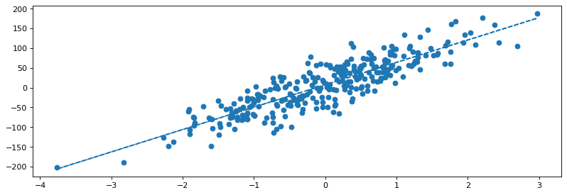
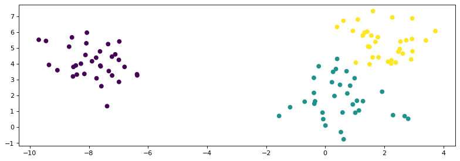
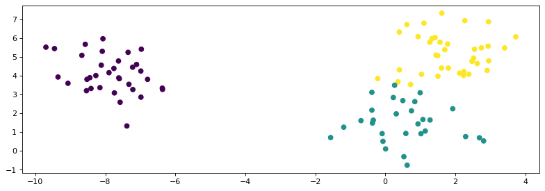
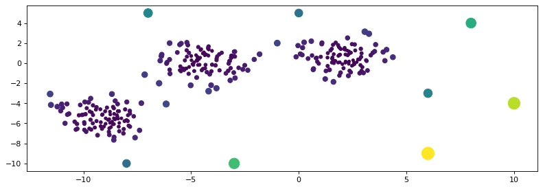
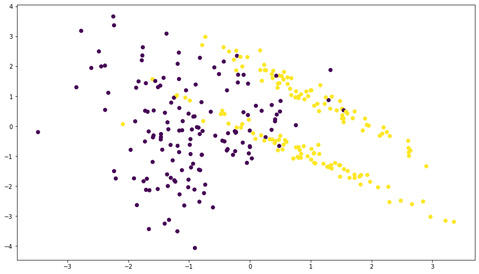
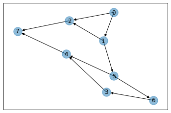

# Machine learning from the scratch

Here I have implemented some algorithms from in python without using libraries.


# Basics

## Lineare Algebra


```python
def matrix_transpose(A):
    return [ [A[j][i] for j in range(len(A))]  
            for i in range(len(A[0]))]


def matrix_subtraktion(A, B):
    return [ [A[i][j] - B[i][j] for j in range(len(A[0]))]    
            for i in range(len(A))] 

def matrix_multiplication(A,B):
    result = []
    for k in range(len(A)):
        k_result = []
        for i in range(len(B[0])):
            sum_i = 0
            for j in range(len(A[0])):
                sum_i += (A[k][j] * B[j][i])
            k_result += [sum_i]
        result += [k_result]
    return result


def dot_product(v, w):
    return sum([v[i] * w[i] for i in range(len(v))])

def l1_norm(v):
    return sum([abs(v[i]) for i in range(len(v))])

def l2_norm(v):
    return math.sqrt(sum([v[i]**2 for i in range(len(v))]))

```

## Statistik


```python
def expected_value(X):
    return sum(X) / len(X)

def sum_of_square_deviations(X):
    return sum((x_i - expected_value(X))**2 for x_i in X)

def variance(X):
    return (sum_of_square_deviations(X) / (len(X)-1))

def standard_deviation(X):
    return variance(X)**0.5

def gaussian_probability_density(x, u, std):
    return ((1 / ( std * math.sqrt(2 * math.pi))) * 
            math.exp( -(1/2) * ( (x - u) / std) )**2 )

def prior_probability(x_i, X):
    return X.count(x_i) / len(X)

def joint_probability(x_i, y_i, X, Y):
    return [x_i == X[i] and y_i == Y[i] 
            for i in range(len(X))].count(True) / len(X)

def conditional_probability(x_i, y_i, X, Y):
    Z = [z for z in list(zip(X, Y)) if z[1] == y_i]
    return [x_i == z[0] for z in Z].count(True) / len(Z)

def marginal_probability(x_i, X, Y):
    return sum([conditional_probability(x_i, y_i, X, Y)
                * prior_probability(y_i, Y) for y_i in Y])

def covariance(X, Y):
    return sum([(X[i] - expected_value(X)) * (Y[i] - expected_value(Y)) 
                for i in range(len(X))]) * (1 / (len(X) -1))

def covariance_matrix(A):
    return [[covariance(i, j) for j in matrix_transpose(A)] 
            for i in matrix_transpose(A)]
```

## Outliers


```python
def get_outliers_by_standard_deviation(X, threshold=3):
       return [x for x in X  if abs(x) > standard_deviation(X) * threshold]
```


## t-test

```python
def t_test(X, Y):
    standard_error = s_p(X, Y) * sqrt( 1/len(X) + 1/len(Y) )
    return  expected_value(X) - expected_value(Y) / standard_error
    
def s_p(X, Y):
    std = lambda x: standard_deviation(x)
    degree_of_freedom = len(X) + len(Y) - 2
    return sqrt( ((len(X)-1)*std(X)**2 + (len(Y)-1)*std(Y)**2) 
                / degree_of_freedom)
```


## z-test 


```python
def z_test(sample, population):
    return ((mean(sample), expected_value(population)) /
            std(population) / sqrt(len(sample)))
```


## Analysis of Variance

```python

def ANOVA(groups):
    merged = sum(groups, [])
    overall_mean = expected_value(merged)
    group_means = sum([[expected_value(g)]*len(g) 
                       for g in groups], [])
    sum_of_squares = sum_of_square_deviations(merged)
    ss_residual = sum([sum_of_square_deviations(g) 
                       for g in groups])
    ss_explained = sum((overall_mean - mean)**2 
                       for mean in group_means)    
    ms_residual = ss_residual / (len(merged) - len(groups))
    ms_explained = ss_explained / (len(groups) - 1)
    f_statistic = ms_explained / ms_residual
    return  f_statistic
```


## Misc


```python
def mean_square_error(Y, Y_prediction):
    return (1 / len(Y)) * sum([(Y[i] - Y_prediction[i])**2 
                               for i in range(len(Y))])

def euclidean_distance(v, w):
    return sqrt(sum([(v[i] - w[i])**2 
                     for i in range(len(v))]))

def euclidean_norm(v):
    return sqrt(sum([x**2 for x in v]))

def scale(X):
    return [(X[i] - expected_value(X)) / standard_deviation(X) 
            for i in range(len(X))]

def cosine_similarity(v, w):
    return dot_product(v, w) / (l2_norm(v) * l2_norm(w))
```

  <h1 style="color:darkblue; font-size:300%"> Regression </h1>


```python
def gradient_descent(X, Y, learning_rate=0.3, m=0, b=0, iterations=5):
    for i in range(iterations):
        b_gradient = - (2 / len(X)) * sum([ Y[i] - ( m * X[i] + b) 
                                           for i in range(len(X))])
        m_gradient = - (2 / len(X)) * sum([ X[i] * (Y[i] - ( m * X[i] + b)) 
                                           for i in range(len(X))])
        b = b - (learning_rate * b_gradient)
        m = m - (learning_rate * m_gradient)
    return b, m
```


```python
# Sample Data
data_regression = make_regression(n_samples=300, n_features=1, n_targets=1, noise=30, bias=10)
data = pd.DataFrame.from_records(data_regression[0], columns =['x'])
data['y'] = data_regression[1]
X = data.x.values
Y = data.y.values
```




# Classification 


```python
p = conditional_probability 
m = marginal_probability
g = gaussian_probability_density

product = lambda L: L[0] * mul(L[1:]) if len(L) > 0 else 1
   
    
def posterior_probability(c, v, X, Y):
    prior = prior_probability(c, Y)
    likelihood = product( [p(v[i], c, [w[i] for w in X], Y) 
                           for i in range(len(v))])
    marginal = product( [m(v[i], [w[i] for w in X], list(Y)) 
                         for i in range(len(v))])
    return (prior * likelihood) / marginal


def gaussian_probability_density(x, u, std):    
    return ((1 / ( std * math.sqrt(2 * math.pi))) * 
            math.exp(-((x - u)**2 / (2 * std**2 ))))


def gaussian_naive_bayes_classifier(v, X, Y):
    results = []
    for class_i in set(Y):
        probability = prior_probability(class_i, Y)  
        X_class_i = [X[j] for j in range(len(Y)) if Y[j] == class_i]
        for i in range(len(v)):
            w = [w[i] for w in X_class_i]
            probability *= g(v[i], expected_value(w), 
                             standard_deviation(w))
        results += [(class_i, probability)]
    return [x[1] for x in results].index(max([x[1] for x in results]))
```





# Custering


```python
def k_means_Lloyd(X, k):
    # Initialisierung: Wähle k zufällige Mittelwerte
    centroids = [list(X[random.randint(0, len(X)-1)]) for i in range(k)]
    last_centroids = None
    while (last_centroids != centroids):

        last_centroids = centroids.copy()

        # Datenobjekt zugeordnen, wobei Cluster-Varianz minimiert wird
        assignments = [min([(sum((X[x_i] - centroids[k_i])**2), k_i) 
                             for k_i in range(k)])[1] 
                       for x_i in range(len(X))]

        # Mittelpunkte der Cluster neu berechnen
        for k_i in range(k): 
            k_i_subset = [X[i] for i in range(len(X)) 
                          if assignments[i] == k_i]
            centroids[k_i] = list(1 / len(k_i_subset) * sum(k_i_subset))
            
    return assignments
```





# Dimension reduction


```python
def principal_component_analysis(A):
    column_means = [mean(column) for column in T(A)]

    # center columns by subtracting column mean
    centers = [ [row[i] - column_means[i] 
                 for i in range(len(A[0]))] for row in A]

    # calculate covariance matrix of centered matrix
    cov = covariance_matrix(centers)

    # calculate eigendecomposition of covariance matrix
    values, vectors = eigenvalues_and_eigenvectors(cov)
    
    # project data into subspace via matrix multiplication
    return T(matrix_multiplication(T(vectors), T(centers)))
```


```python
A = [[1, 2], 
     [3, 4], 
     [5, 6]]

principal_component_analysis(A)
```


    [[-2.82842712474619, 0.0], [0.0, 0.0], [2.82842712474619, 0.0]]


# Anomaly detection


```python
def k_nearest_neighbors(X, y, v, k, regression=False, d=euclidean_distance):
    neighbors = [(d(X[i], v), y[i]) for i in range(len(X))]
    neighbors.sort(key=lambda w: w[1]) # call by reference
    knn =  neighbors[:k]
    labels = [x[1] for x in knn]
    if regression : 
        return sum(labels) / len(labels)
    else: # classification 
        return max(labels, key=labels.count)

```


```python
def knn(v, X, k):
    neighbors = [ (X[i], euclidean_distance(X[i], v)) for i in range(len(X))]
    neighbors.sort(key=lambda w: w[1]) # call by reference
    knn =  neighbors[1:k+1]
    return [x[0] for x in knn]

def outlier_detection_knn(X, k=10):
    knn_table = [ knn(X[j], X, k) for j in range(len(X)) ]
    knn_distance = [ [X[i]  - x  for x in knn_table[i]][k-1] 
                for i in range(len(X)) ]
    return  list(map(euclidean_norm, knn_distance))
```


```python
# Sample Data
X, y = make_blobs(n_samples=300, centers=3, n_features=2, random_state=170)
noise = [ [random.randint(-10, 10), random.randint(-10, 10)] for _ in range(10)]
X = np.append(X, noise, axis=0)
data = pd.DataFrame(dict(x=X[:,0], y=X[:,1]))

knn_distance = outlier_detection_knn(X)
plt.figure(figsize=(12, 4), dpi=80)
plt.scatter(data.x, data.y, c=knn_distance,  s=[x*30 for x in knn_distance])
```





# Association analysis


```python
from functools import reduce

C = ['A', 'B', 'C', 'D', 'E']

X = [ [1, 1, 1, 0, 1], 
      [0, 0, 1, 1, 0], 
      [1, 1, 0, 0, 1],
      [1, 0, 1, 0, 0],
      [1, 1, 1, 1, 1]]

    
transactions = [ frozenset([C[j] for j in range(len(C)) if X[i][j] == 1 ]) 
                for i in range(len(X))]

def merge_subsets(M):
    result = []
    for i in range(len(M)):
        for j in range(i+1,len(M)):
            result += [M[i] | M[j]]
    return set(result)

def support_filter(c_i, transactions, threshold=0.5):
    return [frozenset(c) for c in c_i if support(c, transactions) >= threshold ]


def get_disjoint_subsets(M):
    return [ (x, M - x) for x in  [set(x) for x in list(itertools.combinations(M, len(M)-1))]]


def support(c, A):    
    return [set(c).issubset(a_i) for a_i in A].count(True) / len(X)

def confidence(L, R, M):
    return (support(L | R, M)) / support(L, M)


def apriori_algorithm(transactions, min_support, min_confidence):
    
    # step 1: select all candidates 
    c_i = [ frozenset(x) for x in 
           reduce(lambda i, j: i | j, transactions )]
    candidates = []
    while c_i:
        c_i = merge_subsets(c_i)
        c_i = support_filter(c_i, transactions, threshold=min_support)
        candidates += c_i
        
    # step 2: 
    for candidat in candidates:
        for L, R in get_disjoint_subsets(candidat):
            conv = round(confidence(L, R, transactions),3)
            if conv >= min_confidence:
                print(L , '=>', set(R), 'with ', conv, ' confidence')

apriori_algorithm(transactions, min_support=0.6, min_confidence=0.8)
```

    {'B'} => {'A'} with  1.0  confidence
    {'E'} => {'B'} with  1.0  confidence
    {'B'} => {'E'} with  1.0  confidence
    {'E'} => {'A'} with  1.0  confidence
    {'E', 'B'} => {'A'} with  1.0  confidence
    {'E', 'A'} => {'B'} with  1.0  confidence
    {'B', 'A'} => {'E'} with  1.0  confidence


# Recommendations Systems


```python
member_vector = lambda word, sentence : 1 if (word in sentence) else 0

def term_frequency(term, sentence):
    return sentence.count(term) / len(sentence)

def inverse_data_frequency(term, data):
    m = sum([sentence.count(term) for sentence in data])
    if m == 0:
        return 0
    return math.log(len(data) / m)

def TF_IDF(term, sentence, data, corpus):
    tf = term_frequency(term, sentence)
    idf = inverse_data_frequency(term, data)
    return tf*idf

def preprocess(sentence):
    word_vector = [w.upper() for w in sentence.split(' ')]
    for i in range(len(word_vector)):
        word_vector[i] = "".join([char for char in word_vector[i]
                                  if char.isalpha()])
    return word_vector

def corpus_vector(s, corpus):
    return [member_vector(v, s) for v in corpus]

def vector_TF_IDF(w, data, corpus, v_bin):
    v = []
    for i in range(len(v_bin)):
        if v_bin[i] == 1:
            v += [TF_IDF(corpus[i], w, data, corpus)]
        else:
            v += [0.0]
    return v
```


```python
corpus = ['THE', 'CAR', 'TRUCK', 'IS', 'DRIVEN', 'ON', 'THE', 'ROAD', 'HIGHWAY']
```


```python
s1 = "The car is driven on the road."
s2 = "The truck is driven on the highway."
s3 = 'The Truck is on the highway.'
s4 = 'The Truck on highway.'

data = [ preprocess(s) for s in [s1, s2, s3, s4]]
data
```


    [['THE', 'CAR', 'IS', 'DRIVEN', 'ON', 'THE', 'ROAD'],
     ['THE', 'TRUCK', 'IS', 'DRIVEN', 'ON', 'THE', 'HIGHWAY'],
     ['THE', 'TRUCK', 'IS', 'ON', 'THE', 'HIGHWAY'],
     ['THE', 'TRUCK', 'ON', 'HIGHWAY']]


```python
data_bin = [ corpus_vector(s, corpus) for s in data]
data_bin
```


    [[1, 1, 0, 1, 1, 1, 1, 1, 0],
     [1, 0, 1, 1, 1, 1, 1, 0, 1],
     [1, 0, 1, 1, 0, 1, 1, 0, 1],
     [1, 0, 1, 0, 0, 1, 1, 0, 1]]


```python
data_v = [ vector_TF_IDF(data[i], data, corpus, data_bin[i]) for i in range(len(data))]

```


```python
cosine_similarity(data_v[1], data_v[2])
```


    0.9227357479578236


#  Neural network

```python
from math import e

def sigmoid(x):
    return 1/(1 + e**(-x))


def sigmoid_derivative(x):
    return x * (1 - x)

def random_matrix(i, j):
    return np.random.rand(i,j) 


def matrix_transpose(A):
    return np.array(A).T

sigmoid = lambda x:  1/(1 + e**(-x))
sigmoid_derivative = lambda x: x * (1 - x)

T = lambda M : matrix_transpose(M)
o = lambda A,B : matrix_multiplication(A,B)
f = lambda M: [list(map(sigmoid_derivative, x)) for x in M]


class Neural_Network:
    def __init__(self, x, y):
        self.input = x
        self.weights1= random_matrix(self.input.shape[1],4) 
        self.weights2 = random_matrix(4,1)
        self.y = y
        self.output = np.zeros(y.shape)
        
    def feedforward(self):
        self.layer1 = [list(map(sigmoid, x)) for x in 
                       (o(self.input, self.weights1))]
        self.layer2 = [list(map(sigmoid, x)) for x in 
                       (o(self.layer1, self.weights2))]
        return self.layer2
        
    def backprop(self):
        w = [ 2 * (self.y[i] - self.output[i]) * 
             sigmoid_derivative(self.output[i][0]) 
             for i in range(len(self.y))]
        self.weights2 += o(T(self.layer1), w) 
        self.weights1 += o(T(self.input), o(w, f(T(self.weights2)))) 
                                          
    def train(self, X, y):
        self.output = self.feedforward()
        self.backprop()
        
X = data[['x1', 'x2', 'x3', 'x4']].values
y = np.array([ [i] for i in data['y']], dtype=float)

NN = Neural_Network(X,y)
for i in range(9):
    print ("iteration " + str(i) +  " - Loss: " + str(np.mean(np.square(y - NN.feedforward()))))   
    NN.train(X, y)
```

    iteration 0 - Loss: 0.33357473482095373
    iteration 1 - Loss: 0.19083333333333333
    iteration 2 - Loss: 0.19
    iteration 3 - Loss: 0.18916666666666668
    iteration 4 - Loss: 0.18916666666666668
    iteration 5 - Loss: 0.18916666666666668
    iteration 6 - Loss: 0.1891665048677108
    iteration 7 - Loss: 0.18833333333333332
    iteration 8 - Loss: 0.18833333333333332




# Genetic algorithms

## Knapsack example

```python
from itertools import product


def ks_exhaustive(s_list, v_list, S, k):
    m = len(s_list)                                 
    selection_list = list(product((1,0), repeat=m))     
    for selection in selection_list:
        if v_kS(selection, s_list, v_list, S, k, m):
            return 1
    return 0


def v_kS(selection, s_list, v_list, S, k, m):
    tmp_S = 0
    tmp_k = 0
    for i in range(m):
        if selection[i] == 1:
            tmp_k += v_list[i]
            tmp_S += s_list[i]
    if tmp_S <= S and tmp_k >= k:
        return True
    return False

ks_exhaustive([5, 5, 4, 5, 5],[9, 9, 1, 9, 9],4,1)
```


```python
class Genetic_Algorithm():
    
    def __init__(self, w, v, W):
        self.w = w; self.v = v
        self.W = W; self.m = len(v)
        self.generation = []  # store genes
        self.mutate   = 0.1  # mutation chance
        self.survival = 0.5 # survival chance
        self.n_childs = 64 # population size
        self.n_generations = 1000 # number of generations
        self.best_score = (None, -1)
        
    def populate(self):
        for j in range(self.n_childs):
            self.generation += [ [random.randint(0, 1) 
                                for i in range(self.m)]]
    def fitness(self, genes):
        genes_W, genes_score = 0, 0
        for i in range(self.m):
            if genes[i] == 1:
                genes_W += self.w[i]
                genes_score += self.v[i]
            if genes_W > self.W:
                return -1
        return genes_score
    
    def mutation(self, genes):
        for i in range(self.m):
            if random.uniform(0, 1) <= self.mutate:
                genes[i] = 1 - genes[i]
        return genes
    
    def crossover(self, genes_1, genes_2):
        j = random.randint(1, (self.m-1))
        if random.randint(0,1) == 0: 
            return genes_1[:j] + genes_2[j:]
        return genes_2[:j] + genes_1[j:]
    
    def selection(self):
        evaluation = []
        for genes in self.generation:
            evaluation += [(genes, self.fitness(genes))]
        evaluation.sort(key=lambda w: w[1], reverse=True) 
        if evaluation[0][1] > self.best_score[1]:
            self.best_score = evaluation[0]
        evaluation = [g[0] for g in evaluation]
        self.generation =  evaluation[:round(self.n_childs*self.survival)]
    
    def evolution(self):
        self.populate()  # init generation 
        
        for l in range(self.n_generations):
            self.selection() # surviving of the fittest
            n_parents = len(self.generation)
            for _ in range(self.n_childs - n_parents):
                parent_1 = self.generation[random.randint(0, n_parents -1)]
                parent_2 = self.generation[random.randint(0, n_parents -1)]
                self.generation += [ self.crossover(parent_1, parent_2) ]

            self.generation = [self.mutation(gene) for gene in self.generation]
        return self.generation
          
    
    
ks = Genetic_Algorithm([15, 19, 11, 17, 4, 11, 17, 2, 13, 20], 
                       [10, 7, 8, 14, 15, 17, 6, 2, 3, 2], 
                       48)
ks.evolution()
ks.best_score
```


    ([0, 0, 1, 1, 0, 1, 1, 1, 0, 0], 56)


# Reinforcement learning


```python
import networkx as nx

def plot_wolrd(actions):
    points =[]
    for i in range(len(actions)):
        for j in actions[i]:
            points += [(i, j)]
    G = nx.DiGraph()
    G.add_edges_from(points)
    pos = nx.spring_layout(G)
    nx.draw_networkx_nodes(G,pos, alpha=0.5, arrows=True)
    nx.draw_networkx_edges(G,pos, stlye='dashdot')
    nx.draw_networkx_labels(G,pos)
    plt.figure(figsize=(18, 8), dpi=80)
    plt.show()

#actions = generate_word(5)
actions = [[1, 2], [2, 5], [7], [4], [7], [6, 4], [3], [] ]
plot_wolrd(actions)
```





```python
rewards = [-1, -1, -100, 10, -1, -1, 10, -1, 100]
goal = 7
start = 0
danger = 2
n_states = 8

n_episodes = 100        
max_steps = 10
epsilon = 1.0   
learning_rate = 0.65
```

# Q-Learning


```python
def update_Q_matrix(Q, state, action, value):
    Q[state] =  Q[state][:action] + [value] + Q[state][action+1:]
    return Q
```


```python
Q = [[0]*n_states]*n_states


for episode in range(n_episodes):
    state = start
    # score = rewards[start]
    for step in range(max_steps):
        possible = actions[state]
        if epsilon < random.uniform(0, 1):
            best = -1000
            action = -1
            for p in possible:
                if Q[state][p] > best:
                    action = p
                    best = Q[state][action]
        else:
            action = random.sample(possible,1)[0]
            
        Q = update_Q_matrix(Q, state, state, rewards[action])
                
        future_reward = Q[action].index(max(Q[action]))
        
        value = (1 - learning_rate) * Q[state][action] 
        value += learning_rate * (rewards[action] + future_reward) 
        
        Q = update_Q_matrix(Q, state, action, value)
        
        state = action
        if state == goal or state == danger:
            break 
            
Q
```


    [[-1, 4.0, -100.0, 0, 0, 0, 0, 0],
     [0, -100, -99.99999999673739, 0, 0, 4.999999999745051, 0, 0],
     [0, 0, 0, 0, 0, 0, 0, 0],
     [0, 0, 0, -1, -0.9999724145264648, 0, 0, 0],
     [0, 0, 0, 0, -1, 0, 0, -0.9999999999986011],
     [0, 0, 0, 0, -0.9999999492905722, -1, 15.999251251432618, 0],
     [0, 0, 0, 9.999724145264649, 0, 0, 10, 0],
     [0, 0, 0, 0, 0, 0, 0, 0]]


```python

current_state = 0
steps = [current_state]

while current_state != goal:
    possible = actions[current_state]
    best = -1000
    action = -1
    for p in possible:
        if Q[state][p] > best:
            action = p
            best = Q[current_state][action]                  
    next_step_index = action 
    
    steps.append(next_step_index)
    current_state = next_step_index
    

# Print selected sequence of steps
print("Selected path:")
print(steps)
```

    Selected path:
    [0, 1, 5, 6, 3, 4, 7]


